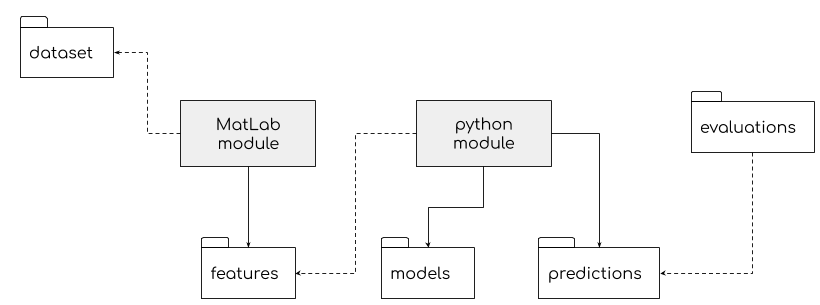

# Zero-Resource Speech Challenge 2020

## 1. Pipeline

-----

### MatLab module

* feature extraction
* creation of submission folder

### Python module

* model training
* prediction of test data

-----

### Evaluations

A bash script loads the predictions per model and type of feature extraction method into the submission folder, 
and uses the conda command for evaluation. To do so, it dynamically creates symbolic link from the predictions folder 
to the submission file.

 